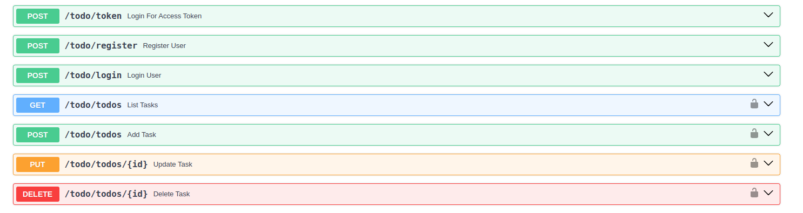

# FAST API apps 

- ### ToDo App

    #### APIs used to manage the tasks
    
    #### Technology Used
    - Python programming lanuguage
    - FastAPI framework for api building
    - Postgres for Tasks and User data management
    - pscopg3 for connecting with postgres

    #### Project requirement source - https://roadmap.sh/projects/todo-list-api
    please visit "/docs" path for detailed documentation of apis
    


## Installation

- Clone Repo

```bash
git clone https://github.com/yashjain23/fastapi_apps.git
```

- Install Dependencies
```bash
pip install -r requirements.txt
```

- Setup Postgres DB on localhost:5432 

- Create database name "postgres"

- Setup schema and tables

    - For ToDo APP APIs
    ```sql
    CREATE SCHEMA todo AUTHORIZATION postgres;

    CREATE TABLE todo.tasks (
        email varchar(255) NOT NULL,
        title varchar(255) NULL,
        description varchar(4095) NULL,
        id serial4 NOT NULL,
        CONSTRAINT tasks_pkey PRIMARY KEY (id)
    );

    CREATE TABLE todo.users (
        full_name varchar(255) NULL,
        email varchar(255) NOT NULL,
        "password" varchar NULL,
        CONSTRAINT user_pkey PRIMARY KEY (email)
    );

    ```

- Create .env file in project root folder and add following
```
HOST = localhost     
PORT = 5432          
DBNAME = postgres   
DBUSER = <Postgres UserName>   
PASSWORD = <Postgres Password>

SECRET_KEY = afgbaosa98!            
ALGORITHM = HS256                   
ACCESS_TOKEN_EXPIRE_MINUTES = 24 
```


- Run Fast API app
```bash
fastapi dev
```

- See API documentation at /docs 
```bash
http://127.0.0.1:8000/docs/
```
## APIs
- ### ToDo APIs "/todo/"
    Project requirement source - https://roadmap.sh/projects/todo-list-api
    